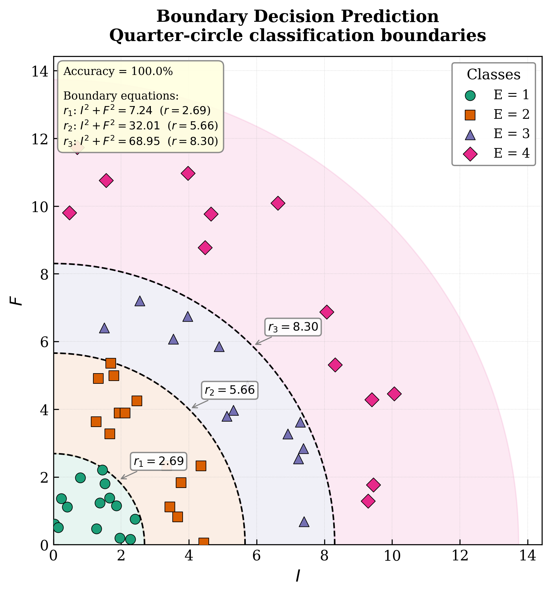

# Boundary Decision Prediction

Classification de données 2D en 4 classes séparées par des frontières en quarts de cercle.

## Problème

Étant donné deux variables scalaires **I** et **F** (dans le quadrant positif), on cherche à classifier chaque observation en 4 classes **E ∈ {1, 2, 3, 4}** délimitées par trois cercles concentriques centrés à l'origine.

Les frontières de décision sont de la forme :

$$I^2 + F^2 = r_k^2, \quad k = 1, 2, 3$$

## Méthode

1. **Génération du jeu de données** : 54 échantillons artificiels répartis en 4 classes dans le premier quadrant
2. **Optimisation** : recherche des 3 rayons optimaux (r₁, r₂, r₃) minimisant le taux de mauvaise classification via Nelder-Mead (scipy)
3. **Visualisation** : graphique 2D de qualité scientifique avec les frontières de décision

## Résultats

| Frontière | Rayon | Équation |
|-----------|-------|----------|
| r₁ | 2.69 | I² + F² = 7.24 |
| r₂ | 5.66 | I² + F² = 32.01 |
| r₃ | 8.30 | I² + F² = 68.95 |

**Précision de classification : 100%**



## Utilisation

```bash
pip install -r requirements.txt
python boundary_decision_prediction.py
```

## Fichiers

| Fichier | Description |
|---------|-------------|
| `boundary_decision_prediction.py` | Script principal |
| `dataset.csv` | Jeu de données généré (I, F, E) |
| `dataset_with_predictions.csv` | Jeu de données avec prédictions |
| `boundary_plot.png` | Graphique des frontières de décision |
| `requirements.txt` | Dépendances Python |
